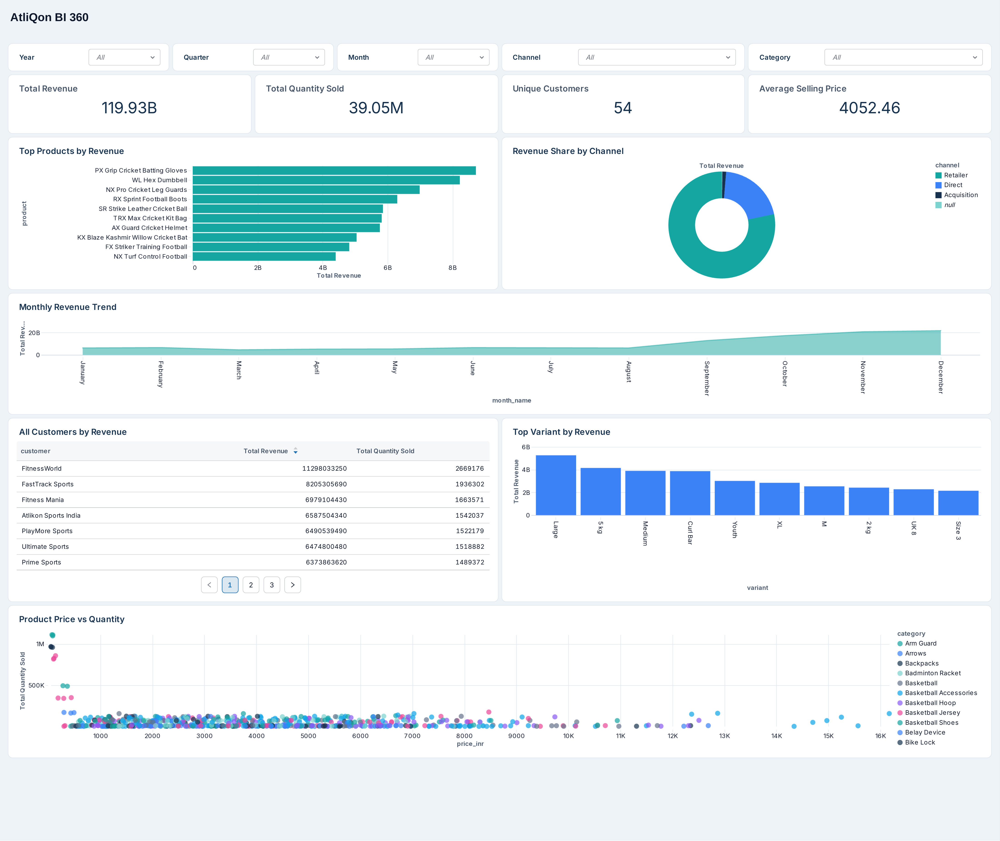

# Retail Acquisition Data Integration Platform

An end-to-end data engineering project that integrates sales data from a parent retail company and an acquired company using **AWS S3, Databricks, PySpark, Delta Lake, PostgreSQL, and SQL**.

The project demonstrates a real-world post-acquisition data integration scenario covering **data ingestion, Medallion Architecture, data quality, dimensional modeling, historical and incremental processing, workflow orchestration, and analytics**.

---

## 📌 Project Overview

This project simulates a business acquisition where an established parent company needs to integrate data from a newly acquired company operating with a separate data platform.

The parent company already has an analytical data model, while the acquired company provides customer, product, pricing, and order data through separate source files with different schemas and data-quality issues.

The pipeline standardizes the acquired-company data and integrates it with the existing parent-company model to create a **unified analytics-ready Gold layer**.

---

## 🛠️ Technology Stack

| Technology | Purpose |
|---|---|
| PostgreSQL / DBeaver | Parent-company source and data validation |
| AWS S3 | Acquired-company source and landing/processed zones |
| Databricks | Lakehouse data engineering and analytics |
| PySpark | Data cleansing and transformations |
| SQL | Data validation, modeling, and analytics |
| Delta Lake | Transactional storage and MERGE operations |
| Unity Catalog | Lakehouse data organization |
| Databricks Workflows | Pipeline orchestration |
| Databricks AI/BI | Analytics and visualization |
| GitHub | Version control and documentation |

---

## 🏗️ Architecture

The parent-company data represents an existing analytical platform.

Data from the acquired company is ingested from **AWS S3** and processed through a **Bronze → Silver → Gold Medallion Architecture** before being standardized and integrated with the parent-company Gold model.

```text
              PARENT COMPANY
                 PostgreSQL
                     │
                     ▼
              Databricks Gold
                     │
                     ▼
             CONSOLIDATED GOLD
                     ▲
                     │
              ACQUIRED COMPANY
                     │
                     ▼
                  AWS S3
                     │
                     ▼
                  BRONZE
                 Raw Data
                     │
                     ▼
                  SILVER
             Clean & Standardize
                     │
                     ▼
                   GOLD
              Business-Ready
                     │
                     └──────► Consolidated Gold
```

---

## 📊 Data Model

The consolidated Gold layer follows a dimensional model containing:

```text
fmcg.gold
│
├── dim_customers
├── dim_products
├── dim_gross_price
├── dim_date
└── fact_orders
```

The parent-company source data was validated in PostgreSQL for **primary-key uniqueness, null constraints, and fact-to-dimension relationships** before integration.


---

## 🥉🥈🥇 Medallion Data Pipeline

### Bronze
Raw customer, product, pricing, and order data is ingested from AWS S3 into Delta tables while preserving source-level data for traceability and reprocessing.

### Silver
PySpark transformations perform:

- Deduplication and missing-value handling
- Data-type and schema standardization
- Customer and location cleansing
- Product, category, variant, and division standardization
- Pricing and order transformations
- Alignment with the parent-company data model

### Gold
Business-ready dimensions and facts are created and integrated with the existing parent-company model using **Delta Lake MERGE operations**.

---

## ⚡ Historical & Incremental Processing

The order pipeline supports both an initial historical load and incremental processing of newly arriving order files.

For incremental processing, a staging layer isolates the current batch so only new data is transformed. Successfully processed files are moved from the S3 `landing` location to `processed`, preventing duplicate file processing.

```text
New Order File
      │
      ▼
  S3 Landing
      │
      ├──────► Bronze (Raw History)
      │
      ▼
   Staging
      │
      ▼
    Silver
      │
      ▼
 Child Gold
      │
      ▼
Consolidated Gold
```


---

## ⚙️ Databricks Workflow Orchestration

The acquired-company pipeline is orchestrated using **Databricks Workflows** with dependency-based execution:

**Customers → Products → Gross Price → Incremental Fact Orders**

The workflow automates dimension processing followed by incremental fact processing and updates the consolidated Gold model when new order data arrives.


---

## 📥 Parent Company Incremental Load

New parent-company order data is incrementally loaded into the consolidated Gold fact table using Databricks `COPY INTO`.

The incremental load processed **4,485 new records with zero corrupt files**, bringing the consolidated `fact_orders` table to **101,212 records**.

This demonstrates a second incremental ingestion pattern alongside the Delta Lake MERGE-based acquired-company pipeline.

---

## 📈 Analytics Layer

An analytics-ready Gold view, `fmcg.gold.vw_fact_orders_enriched`, combines order data with customer, product, pricing, and date dimensions.

A **Retail Sales 360 Dashboard** was built using Databricks AI/BI to provide visibility into:

- Total revenue and quantity sold
- Customer performance
- Product and variant performance
- Revenue by sales channel
- Monthly revenue trends
- Product price vs. sales volume



---

## 📁 Repository Structure

```text
fmcg-data-engineering-project/
│
├── architecture/
│   ├── parent-company-schema.png
│   └── incremental-fact-orders-pipeline.png
│
├── data-quality/
│   └── data-quality-rules.md
│
├── docs/
│   ├── data-pipeline.md
│   └── incremental-processing.md
│
├── notebooks/
│   ├── README.md
│   ├── utilities.py
│   ├── 1_setup/
│   ├── 2_dimension_data_processing/
│   └── 3_fact_data_processing/
│
├── screenshots/
│   ├── atliqon-bi-360-dashboard.png
│   ├── databricks-workflow-success.png
│   └── postgresql/
│
├── sql/
│   └── parent-data-validation.sql
│
└── README.md
```

---

## 🔑 Key Engineering Concepts

**AWS S3 • Databricks • PySpark • SQL • Delta Lake • Unity Catalog • Medallion Architecture • ETL/ELT • Dimensional Modeling • Data Quality • Incremental Processing • Delta MERGE • COPY INTO • Databricks Workflows • Analytics**
