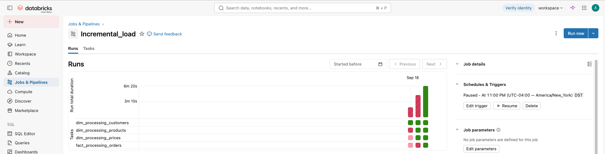

# FMCG Data Engineering Platform

An end-to-end data engineering project that integrates FMCG sales data from a parent company and an acquired child company using AWS S3, Databricks, PySpark, Delta Lake, PostgreSQL, and SQL.

The project demonstrates data ingestion, Medallion Architecture, data quality, dimensional modeling, historical and incremental processing, and parent-child data consolidation.

---

## 📌 Project Overview

This project simulates an FMCG (Fast-Moving Consumer Goods) business scenario where a parent company acquires a child company.

The parent company already has an established analytical data model, while the acquired child company (Sports Bar) provides data through separate source files with different schemas and data-quality issues.

The pipeline standardizes the child-company data and integrates it with the existing parent-company model to create a unified analytical platform.

---

## 🎯 Project Objectives

- Build an end-to-end data engineering pipeline
- Implement Bronze, Silver, and Gold layers
- Ingest source data from AWS S3
- Perform data cleansing and transformation using PySpark
- Implement data-quality rules
- Build fact and dimension models
- Process historical and incremental data
- Use Delta Lake MERGE operations
- Consolidate parent and child-company data
- Produce analytics-ready Gold datasets
- Practice production-oriented Databricks data engineering concepts

---

## 🏗️ Technology Stack

| Technology | Purpose |
|---|---|
| PostgreSQL | Parent-company relational source |
| DBeaver | Database development and validation |
| AWS S3 | Child-company source data and landing zone |
| Databricks | Lakehouse data engineering platform |
| PySpark | Data processing and transformations |
| SQL | Data validation, modeling, and analytics |
| Delta Lake | Transactional storage and MERGE operations |
| Databricks Workflows | Pipeline orchestration |
| GitHub | Version control and documentation |
| Power BI | Analytics and visualization |

---

## 🏛️ Architecture

The parent company represents an existing analytical platform.

The acquired child-company data is ingested from AWS S3 and processed through a Databricks Medallion Architecture before being standardized and consolidated with the parent-company Gold model.

```text
                 PARENT COMPANY
                    PostgreSQL
                        |
                        v
                 Existing Model
                        |
                        v
                 Databricks Gold
                        |
                        |
                        v
              +--------------------+
              | CONSOLIDATED GOLD  |
              |  Parent + Child    |
              +--------------------+
                        ^
                        |
                   CHILD COMPANY
                    Sports Bar
                        |
                        v
                     AWS S3
                        |
                        v
                     BRONZE
                    Raw Data
                        |
                        v
                     SILVER
              Clean & Standardize
                        |
                        v
                      GOLD
                Business-Ready
                        |
                        v
              Parent + Child Merge
```

---

## 📊 Parent Company Data Model

The parent-company dataset represents the existing analytical model and provides the target structure for integrating the acquired child-company data.

### PostgreSQL Source

```text
parent_company
│
├── dim_customers
├── dim_products
├── dim_gross_price
└── fact_orders
```

### Source Validation

| Table | Records | Primary Key |
|---|---:|---|
| `dim_customers` | 18 | `customer_code` |
| `dim_products` | 397 | `product_code` |
| `dim_gross_price` | 794 | `product_code`, `year` |
| `fact_orders` | 93,055 | `date`, `product_code`, `customer_code` |

Primary-key uniqueness, null constraints, and relationships between the fact and dimension tables were validated before integration.

### Databricks Gold Model

The existing analytical model is represented in Databricks as:

```text
fmcg.gold
│
├── dim_customers
├── dim_products
├── dim_gross_price
├── dim_date
└── fact_orders
```

The `dim_date` dimension supports time-based reporting and analytics.

---

## 🔄 Child Company Data Pipeline

Sports Bar source data is stored in AWS S3 and processed through the Databricks Medallion Architecture.

### 🥉 Bronze

Raw customer, product, pricing, and order data is ingested from AWS S3 into Delta tables.

The Bronze layer preserves source-level data and ingestion metadata for traceability and reprocessing.

### 🥈 Silver

PySpark transformations clean and standardize the source data.

Processing includes:

- Deduplication
- Missing-value handling
- Data-type standardization
- Customer and location standardization
- Product, category, variant, and division standardization
- Pricing transformations
- Fact-data transformation
- Schema alignment with the parent-company model

### 🥇 Gold

Business-ready child-company datasets are created and integrated with the parent-company model using Delta Lake `MERGE` operations.

Consolidated Gold tables include:

```text
fmcg.gold.dim_customers
fmcg.gold.dim_products
fmcg.gold.dim_gross_price
fmcg.gold.dim_date
fmcg.gold.fact_orders
```

---

## 📦 Fact Orders Processing

The fact pipeline supports both **historical backfill** and **incremental processing**.

### Historical Load

Historical order files are processed through:

```text
S3 Landing
    ↓
Bronze
    ↓
Silver
    ↓
Child Gold
    ↓
Consolidated Gold
```

After successful ingestion, processed source files are moved from the S3 `landing` directory to the `processed` directory.

The child-company fact data is transformed to match the parent-company fact structure before consolidation.

---

## ⚡ Incremental Processing

After the historical backfill, newly arriving daily order files are processed incrementally rather than reprocessing the complete historical dataset.

A staging layer isolates the current batch so transformations operate only on newly arrived records.

```text
New Daily File
      ↓
S3 Landing
      ↓
 ┌───────────────┐
 │ Current Batch │
 └───────┬───────┘
         │
    ┌────┴─────┐
    ↓          ↓
 Bronze     Staging
    │          │
    │          ↓
    │       Silver
    │          ↓
    │      Child Gold
    │          ↓
    └──→ Consolidated Gold

S3 Landing → Process → S3 Processed
```

The incremental design provides:

- Processing of newly arrived records only
- Preservation of complete raw history in Bronze
- Batch isolation through staging tables
- Incremental Silver and Gold updates
- Delta Lake merge/upsert processing
- Protection against reprocessing previously consumed source files

### Incremental Architecture


---

## 🏆 Consolidated Gold Model

The final Gold layer provides a unified analytical model containing standardized data from both the parent and acquired child company.

```text
                    fact_orders
                         |
          +--------------+--------------+
          |              |              |
          v              v              v
   dim_customers    dim_products   dim_gross_price
                         |
                         v
                     dim_date
```

This model supports analysis across customers, products, pricing, dates, platforms, and sales transactions.

---

## 📁 Repository Structure

```text
fmcg-data-engineering-project/
│
├── architecture/
│   ├── parent-company-schema.png
│   └── incremental-fact-orders-pipeline.png
│
├── data-quality/
│   └── data-quality-rules.md
│
├── docs/
│   ├── data-pipeline.md
│   └── incremental-processing.md
│
├── notebooks/
│   ├── dimensions/
│   └── facts/
│
├── screenshots/
│   └── postgresql/
│
├── sql/
│   └── parent-data-validation.sql
│
└── README.md
```

---

## 📚 Technical Documentation

Detailed implementation documentation is maintained separately to keep this README concise.

- **Data Pipeline:** `docs/data-pipeline.md`
- **Incremental Processing:** `docs/incremental-processing.md`
- **Data Quality Rules:** `data-quality/data-quality-rules.md`
- **Parent Data Validation:** `sql/parent-data-validation.sql`

---

## Databricks Workflow Orchestration

The child-company data pipeline is orchestrated using Databricks Workflows to execute dimension and fact processing in dependency order.

The workflow executes:

**Customers → Products → Gross Price → Incremental Fact Orders**

Each task runs only after its upstream dependency completes successfully. The Fact Orders task processes only newly arrived order files from the S3 landing area, applies Bronze and Silver transformations, updates the child-company Gold layer, and refreshes the affected monthly data in the consolidated Gold fact table.

This provides an automated and dependency-driven pipeline for processing new child-company data.



---
## Parent Company Incremental Load

Incremental parent-company order data is loaded into the consolidated Gold fact table using Databricks `COPY INTO`.

New order files are uploaded to a Unity Catalog Volume and incrementally ingested into `fmcg.gold.fact_orders`, with explicit data type casting applied during ingestion.

The incremental load successfully processed **4,485 new records with zero corrupt files**, increasing the consolidated fact table to **101,212 records**.

This enables both parent-company and acquired child-company order data to be maintained within the same consolidated Gold model.
